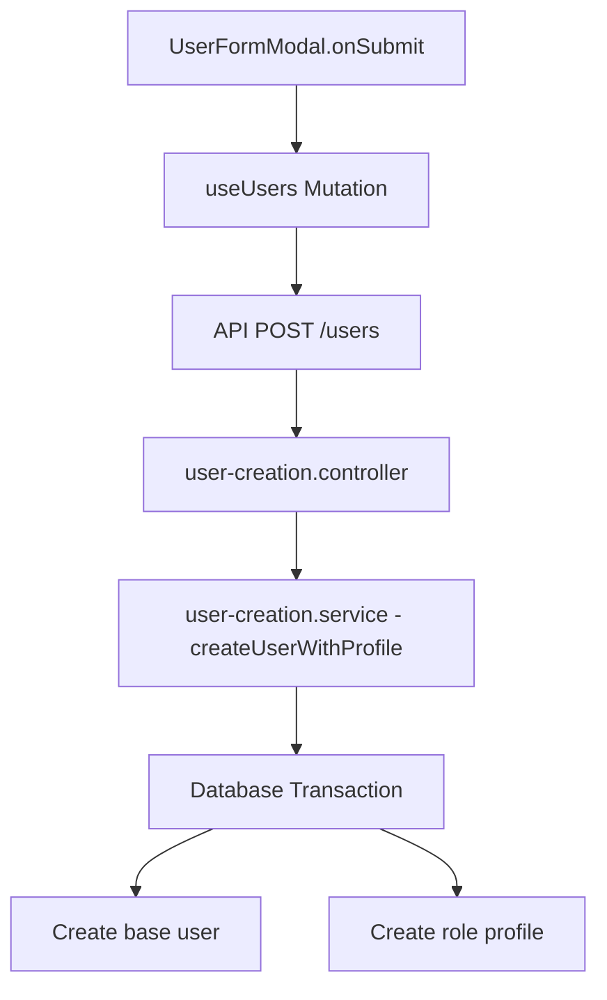
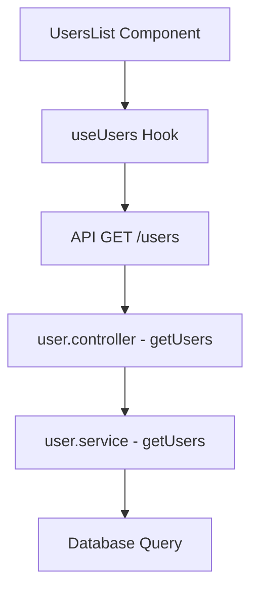
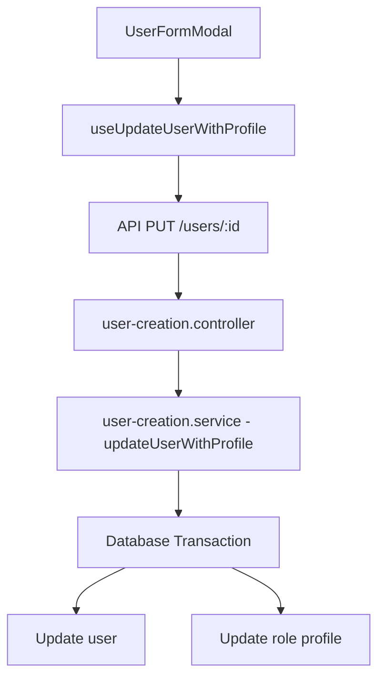
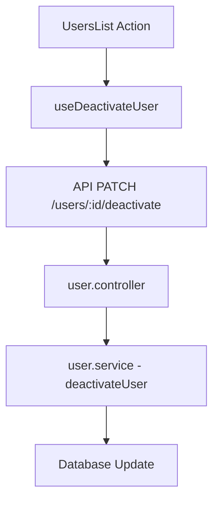
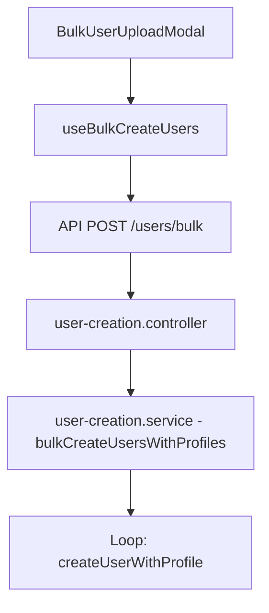

# EduTrak User Management System CRUD Operations

Complete CRUD operations for EduTrak user management system covering frontend React components, React Query hooks, API layer, and backend services with atomic database transactions.

## Key Flows

### 1. Single User Creation Flow

### 2. User Listing and Filtering

### 3. User Update with Profile

### 4. User Deactivation/Deletion

### 5. Bulk User Creation

## Key Implementation Details

### Role-Specific Profile Creation
- Handled in `user-creation.service.ts`
- Uses Prisma transactions for atomic operations
- Supports multiple role types (STUDENT, TEACHER, GUARDIAN)
- Each role has its own profile table with specific fields

### Data Flow
1. Frontend collects user data and role-specific profile data
2. Data is sent to the backend in a single request
3. Backend validates and processes the data in a transaction
4. User and profile records are created/updated atomically

### Error Handling
- Transaction rollback on failure
- Detailed error messages for validation failures
- Bulk operations report individual failures without affecting successful operations

### Security
- Role-based access control
- Data validation at all layers
- Atomic operations to prevent data inconsistencies
